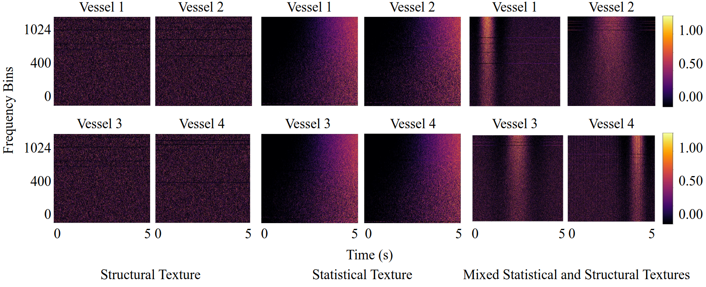

# Quantitative Measures for Passive Sonar Texture Analysiss:
<p align="center">
  
</p>


**Quantitative Measures for Passive Sonar Texture Analysis**

Jarin Ritu, Alexandra Van Dine and Joshua Peeples

Note: If this code is used, cite it: Jarin Ritu, Alexandra Van Dine and Joshua Peeples. (2025, April 22) Peeples-Lab/Passive_Sonar_Texture_Analysis
: Initial Release (Version v1.0). 


[`arXiv`](https://arxiv.org/abs/2504.14843)

[`BibTeX`](#CitingHist)


In this repository, we provide the paper and code for "Quantitative Measures for Passive Sonar Texture Analysis."

## Installation Prerequisites


The [`requirements.txt`](requirements.txt) file includes all the necessary packages, and the packages will be installed using:

   ```pip install -r requirements.txt```

## Demo

To get started, please follow the instructions in the [Datasets](Datasets) folder to download the dataset.
Next, run [`demo.py`](demo.py) in Python IDE (e.g., Spyder) or command line to train, validate, and test models. 
To evaluate performance,
run [`View_Results.py`](View_Results.py) (if results are saved out).


## Main Functions

The target classification code uses the following functions. 

1. Intialize model  

   ```model, input_size, feature_layer = intialize_model(**Parameters)```

2. Prepare dataset(s) for model
   
   ```dataloaders_dict = Prepare_Dataloaders(**Parameters)```

3. Train model 

   ```train_dict = train_model(**Parameters)```

4. Test model

   ```test_dict = test_model(**Parameters)```


## Parameters

The parameters can be set in the following script:
   
[`Demo_Parameters.py`](Demo_Parameters.py)

## Inventory

```
https://github.com/Peeples-Lab/HLTDNN 

└── root directory
    ├── demo.py                                   // Run this. Main demo file.
    ├── Demo_Parameters.py                        // Parameter file for the demo.
    ├── Prepare_Data.py                           // Load dataset for the demo. 
    ├── View_Results.py                           // Run this after the demo to view saved results. 
    └── Datasets                
        ├── Get_Preprocessed_Data.py              // Resample the audio data and generate segments for the dataset.
        └── DeepShipSegments.py                   // Create a custom dataset for DeepShip/VTUAD/Synthetic
    └── Utils                     
        ├── Class_information.py                  // Class names for dataset for the results script.
        ├── Compute_FDR.py                        // Compute Fisher’s discriminant ratio.
        ├── Confusion_mats.py                     // Create and plot confusion matrix.
        ├── Generate_Learning_Curves.py           // Generate learning curves for training and validation.
        ├── Generate_TSNE_visual.py               // Generate TSNE visuals.
        ├── Generate_Spatial_Dims.py              // Compute spatial dimensions for histogram layer models.
        ├── Get_Optimizer.py                      // Define a set of optimizers to choose from.
        ├── Histogram_Model.py                    // Load histogram model with TDNN (or any backbone network).
        ├── Network_functions.py                  // Contains functions to initialize, train, and test the model.
        ├── RBFHistogramPooling.py                // Create histogram layer.
        ├── Save_Results.py                       // Save results from the demo script.
        ├── pytorchtools.py                       // Implement early stopping to terminate training based on validation metrics.
        └── Feature_Extraction_Layer.py           // Extract and transform different features from the audio files.
        └── TDNN.py                               // Baseline TDNN model.
        └── synthetic_statistical_texture.py      // Create synthetic statistical texture dataset.
        └── synthetic_structural_texture.py       // Create synthetic structural texture dataset.
        └── synthetic_mixed_texture.py            // Create synthetic mixed statistical and structural textures dataset.
        └── StaTS.py                              // Quantify statistical texture.
        └── StrTS.py                              // Quantify structural texture.


```

## License

This source code is licensed under the license found in the [`LICENSE`](LICENSE) file in the root directory of this source tree.

This product is Copyright (c) 2025 J. Ritu, A. Dine and J. Peeples. All rights reserved.

## <a name="CitingHist"></a>Citing Quantitative Measures for Passive Sonar Texture Analysis

If you use the Quantitative Measures for Passive Sonar Texture Analysis code, please cite the following reference using the following entry.

**Plain Text:**

J. Ritu, A. Dine and J. Peeples, "Quantitative Measures for Passive Sonar Texture Analysis," 2025 TBD

**BibTex:**

```
TBD
```
